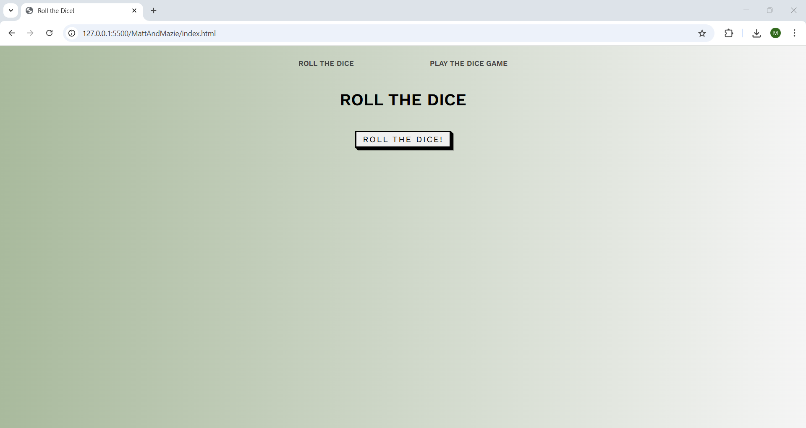
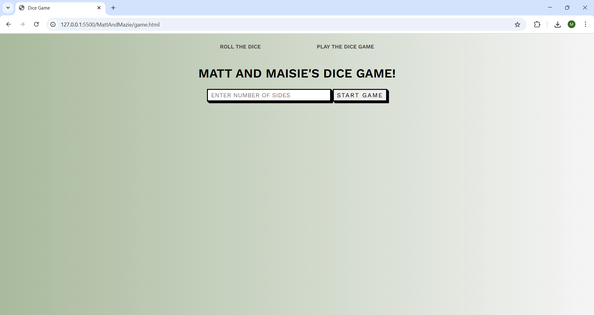

# Roll the dice with Matt Thomas & Maisie Bishop

Matthew and Maisie have created a two-page web application. The first page allows you to roll a 6-sided dice and get a image result of a dice. The second page allows you to play a dice roll guessing game.

## Installation/Usage

Create a directory to clone the repository into.

Go to your project directory
```
cd <your repository folder>
```
Clone the repository into your folder.
```
git clone git@github.com:matthewthomas1999/MattAndMazie.git

```
Open the project in VSCode or your preferred editor

For VSCode
```
code .
```
Open `index.html` in a browser or use the a local server (e.g. VSCode Live Server).

Use the interface as intended.

You can also see the deployed application [here](https://gleaming-hotteok-34604f.netlify.app/game).

## Tech Stack

<details>
<summary>Languages:</summary> 

- HTML 
- CSS 
- JavaScript
</details>


<details>
<summary>Tools & Environment:</summary> 

- Visual Studio Code
- Git & GitHub
- Live Server
</details>

<details>
<summary>Project Type:</summary>
 
- Frontend web application
</details>


## Demo

First page will look like this. Just click the button to get a random dice roll.



Second page will look like this. The instructions will be on the screen, but if you enter the number of sides of your dice, and then your guess, the app will let you know if you have guessed your roll correctly.



A fun gif will show if you've won or lost!

## Acknowledgements

Many thanks to the La Fosse Academy training team, in particular:
- Manish Gadhvi
- Monia Favaro
- Simon Clemson
```
